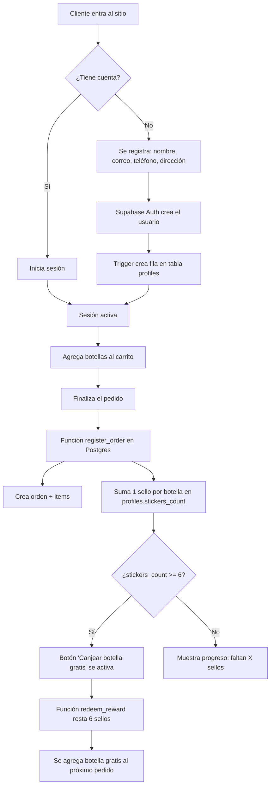

# Arquitectura técnica — Salsas Calypso

## Diagrama de flujo general

## Componentes del sistema

### 1. Frontend (React + Vite)
Sitio de una sola página con las secciones pedidas: Inicio, Historia, Tienda, Club Calypso.
Todo el estado de sesión, carrito y sellos vive en `App.jsx` y se sincroniza con Supabase.

### 2. Autenticación (Supabase Auth)
- Registro con correo y contraseña; se guardan `name`, `phone` y `address` como metadata del usuario.
- Un **trigger** en la base de datos (`on_auth_user_created`) crea automáticamente la fila
  correspondiente en `profiles` apenas alguien se registra — así nunca hay usuarios sin perfil.
- Esta tabla `profiles` es tu base de datos centralizada de clientes para campañas de marketing.

### 3. Base de datos (Postgres vía Supabase)

| Tabla | Contenido |
|---|---|
| `profiles` | Datos del cliente + `stickers_count` (sellos acumulados) |
| `orders` | Una fila por pedido, con el total |
| `order_items` | Detalle de sabores y cantidades de cada pedido |

Ver el esquema completo y comentado en `database-schema.sql`.

### 4. Lógica del Club Calypso (gamificación)
Toda la lógica de sellos vive **en la base de datos**, no en el frontend — esto evita que alguien
manipule el número de sellos desde el navegador.

- `register_order(items)`: función que registra el pedido y suma 1 sello por cada botella
  (no cuenta las botellas gratis ya canjeadas).
- `redeem_reward()`: función que valida que haya 6 o más sellos, resta 6 y confirma el canje.

El frontend solo llama a estas funciones (`supabase.rpc(...)`) y muestra el resultado.

### 5. Seguridad (Row Level Security)
Cada cliente solo puede leer y modificar **su propia fila** en `profiles`, `orders` y `order_items`.
Las funciones de sellos corren con permisos elevados (`security definer`) para poder actualizar el
contador de forma controlada, sin exponer esa lógica al cliente.

## Puntos de integración pendientes

| Necesidad | Recomendación |
|---|---|
| Pagos reales | Stripe Checkout (tarjetas internacionales) o Yappy/PayPal para Panamá |
| Envío de correos (bienvenida, confirmación de pedido) | Supabase ya envía el correo de confirmación de cuenta; para correos de marketing usa Mailchimp o Klaviyo conectado a la tabla `profiles` |
| Hosting | Vercel o Netlify (despliegue directo desde este repositorio) |
| Dominio | Conectar `salsascalypso.com` (o el que elijas) desde el panel del hosting |

## Alternativa sin código (si prefieres no mantener este repositorio)

Si en algún momento prefieres no operar tú mismo el código: **Shopify** + una app de fidelización
como **Smile.io** replican el mismo comportamiento (carrito, cuentas, sellos y recompensas) sin
necesidad de programar ni mantener una base de datos. La desventaja es menos control y una
mensualidad fija; la ventaja es cero mantenimiento técnico.
